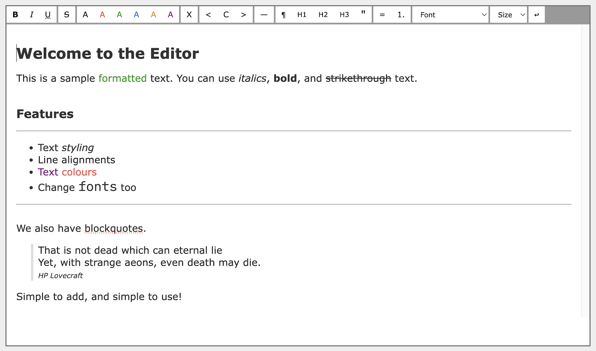

# Simple Editor v1.1.0

A rich text client side web editor in vanilla JavaScript and CSS.

## Contents

- [Features](#features)
- [Screenshot](#screenshot)
- [Examples](#examples)
- [Usage](#usage)
  - [Linking in the required JavaScript and CSS](#linking-in-the-required-javascript-and-css)
  - [Adding a placeholder into your page](#adding-a-placeholder-into-your-page)
  - [Activating the editor](#activating-the-editor)
- [Options](#options)
  - [Changing which features are visible](#changing-which-features-are-visible)
  - [Changing which fonts are available](#changing-which-fonts-are-available)
- [Content](#content)
- [Events](#events)
- [License](#license)

## Features

- Extremely simple to set up (no build pipelines or bundling)
- Styling (bold, italic, underline, strikethrough, text colour)
- Alignment (left, right, center)
- Headings (paragraphs and h1, h2, h3)
- Bullets and numbered lists
- Blockquotes
- Font selection and size
  - Default font choices can be overridden
  - Unavailable fonts silently suppressed
- Optional change event callback
- Get content as either escaped or raw HTML
- Options to select which features are shown

Coming soon:

- More change event handling options

Handwritten. No AI.

## Screenshot



*(from example 2 as detailed below)*

## Examples

There are five example HTML files in the repo:

- [Example 1](./example-1.html) is a simple out-of-the-box experience
- [Example 2](./example-2-showing-changing-source.html) has a change event handler that shows the HTML source for the text being edited
- [Example 3](./example-3-some-buttons-hidden.html) shows how to pass options to hide chosen editor features
- [Example 4](./example-4-custom-fonts.html) shows how to override the default list of fonts
- [Example 5](./example-5-no-fixed-width.html) shows the behaviour without a fixed width editor

## Usage

### Linking in the required JavaScript and CSS

- Download and link to the [CSS file](./dist/simple-editor.css) from the `dist` folder (place this at the end of the `head` of your page)
- Download and link to the [JavaScript file](./dist/simple-editor.js) from the `dist` folder (place this at the end of the `body` of your page)

``` html
<!DOCTYPE html>
<html>
<head>

    <link rel="stylesheet" href="dist/simple-editor.css">
</head>
<body>

    <script src="dist/simple-editor.js"></script>
</body>
</html>
```

The examples also link to `style.css` but that's not part of the editor and only serves the needs of the example page itself.

### Adding a placeholder into your page

- A single `div` is all that's needed
- Your own CSS can set the editor sizing by targeting this `id`

``` html
<div id="my-editor"></div>
```

### Activating the editor

- Simple Editor attaches to the `div` you just added
- Ensure you only do this after the page has loaded
- Place this at the bottom of the `body` (*after* the script is linked)

``` html
<script>
    // Wait till the page is ready
    document.addEventListener("DOMContentLoaded", function() {

        // Convert the div to an editor
        simpleEditor.attach('my-editor');

    });
</script>
```

## Options

### Changing which features are visible

- [See example 3](./example-3-some-buttons-hidden.html)

The call to `simpleEditor.attach` can also suppress specific features.
For example you may support bold, italics, and underline, but nothing else.

Here's an example of specifying options:

``` javascript
simpleEditor.attach('my-editor', {
    allowStrikethrough: false,
    allowClear: false,
    allowAlignment: false,
    allowHeading1: false,
    allowFonts: false,
    allowUndo: false
});
```

Here's the list of options supported, taken from `simpleEditor.defaultOptions`:

- `allowStyling` - bold, italics, underline
- `allowStrikethrough` - strikethrough
- `allowColors` - changing text color
- `allowClear` - removing character-level formatting
- `allowAlignment` - paragraph alignment
- `allowLines` - horizontal lines
- `allowHeading1` - top level heading
- `allowSubheadings` - headings 2 and 3
- `allowBlockquotes` - indented blocks
- `allowUnorderedLists` - bullet lists
- `allowOrderedLists` - numbered lists
- `allowFonts` - changing the font
- `allowFontSizes` - changing the font size
- `allowUndo` - undo (always available from the keyboard)

### Changing which fonts are available

- [See example 4](./example-4-custom-fonts.html)
- For the full list of default fonts look at the `fonts` array in [`simple-editor.js`](./dist/simple-editor.js)

*Before* calling `simpleEditor.attach` you can set the list of fonts the user can choose from:

``` javascript
simpleEditor.fonts = ['Arial', 'Sans-Serif', 'Tahoma', 'Verdana'];
simpleEditor.attach('my-editor');
```

*Fonts are checked for at runtime, and if the user's device doesn't have a particular font available it is not included as an option.*

## Content

- [See example 2](./example-2-showing-changing-source.html)

Methods exist to get and set the content of the editor, which is always in HTML format.

- `simpleEditor.setContent('<p>This is <b>bold</b> text.</p>')`
  - Any text with HTML markup is fine, but ideally only allow markup that your choice of active editor features supports
- `simpleEditor.getContent()`
  - Get the current user text, with HTML *escaped* (eg `&lt;b&gt;bold text&lt;/b&gt;`)
- `simpleEditor.getContent(true)`
  - Get the current user text, with *raw* HTML (eg `<b>bold text</b>`)

## Events

- [See example 2](./example-2-showing-changing-source.html)

*Before* calling `simpleEditor.attach` you can provide optional event handlers for when the text changes.

``` javascript
simpleEditor.onchange(() => { sourceDiv.innerHTML = simpleEditor.getContent(); });
simpleEditor.onChange(() => console.log('Changed!'));
simpleEditor.attach('my-editor');
```

This example adds two handlers for when the text changes:
- The first sets an element (already captured as `sourceDiv`) to always show the latest escaped (safe) HTML
- The second is a simple message in the console to say something has changed

Actual text is not passed directly to handlers for two reasons:

- That's extra overhead when some usages may not need the text
- It's not known in advance if you want unescaped or raw HTML

## License

Copyright K Cartlidge, 2025.

[MIT license](./LICENSE.md)

## Implementation Note

*In common with most rich editors* it uses `execCommand` which is marked as deprecated (not obsolete).

The deprecation is largely because no exact standard exists, but ongoing in-browser support is virtually guaranteed as there are no spec'ed alternatives.
For example, https://github.com/whatwg/html/pull/7064 discusses a declined pull request to remove it's recommended use from the specs ("*User agents are encouraged to implement the features described in execCommand*").
